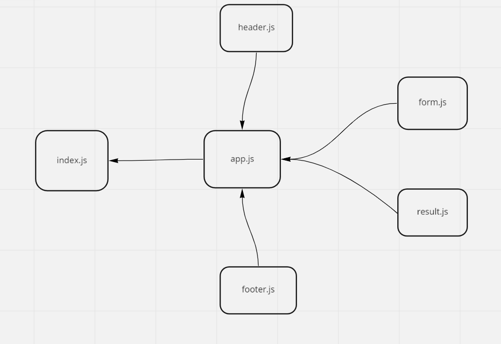

[phase-3 netlify link](https://62828b34ad0b7c060e34e5cd--statuesque-cascaron-dba3b8.netlify.app/)

UML 

## phase_3   
in this phase i used useEffect hook to remove data from the result text area after 15 sec   
[phase-3 PR](https://github.com/idreesalmasri/RESTy-deploy/pull/1)
